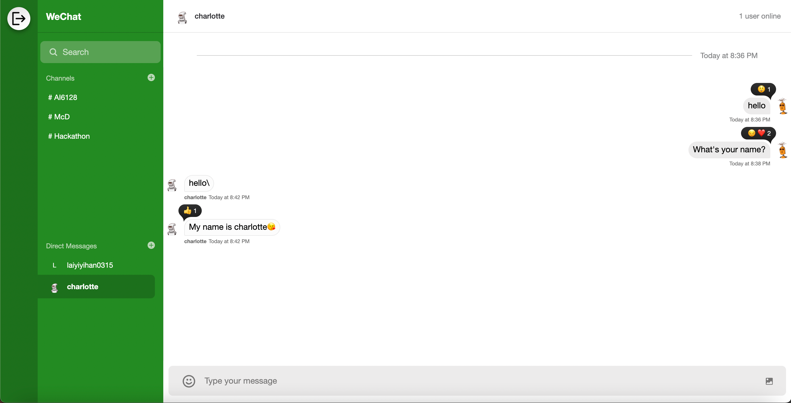

<!-- ABOUT THE PROJECT -->

## About The Project

This is a web application in which you can have a real-time chatting with your friends.
This application is powered with [GetStream.io](https://getstream.io/)

Project Demo: [Visit here](https://realtime-chat-messaging-nine.vercel.app/)

### Built With

- [![React][React.js]][React-url]
- [![TypeScript][TS-img]][TS-url]
- [![NodeJS][Node-img]][Node-url]
- [![Vite][Vite-img]][Vite-url]
- [![Vercel][Vercel-img]][Vercel-url]

<!-- MARKDOWN LINKS & IMAGES -->
<!-- https://www.markdownguide.org/basic-syntax/#reference-style-links -->

[React.js]: https://img.shields.io/badge/React-20232A?style=for-the-badge&logo=react&logoColor=61DAFB
[React-url]: https://reactjs.org/
[TS-img]: https://img.shields.io/badge/typescript-%23007ACC.svg?style=for-the-badge&logo=typescript&logoColor=white
[TS-url]: https://www.typescriptlang.org/
[Node-img]: https://img.shields.io/badge/node.js-6DA55F?style=for-the-badge&logo=node.js&logoColor=white
[Node-url]: https://nodejs.org/en
[Vite-img]: https://img.shields.io/badge/vite-%23646CFF.svg?style=for-the-badge&logo=vite&logoColor=white
[Vite-url]: https://vitejs.dev/
[Vercel-img]: https://img.shields.io/badge/vercel-%23000000.svg?style=for-the-badge&logo=vercel&logoColor=white
[Vercel-url]: https://vercel.com

